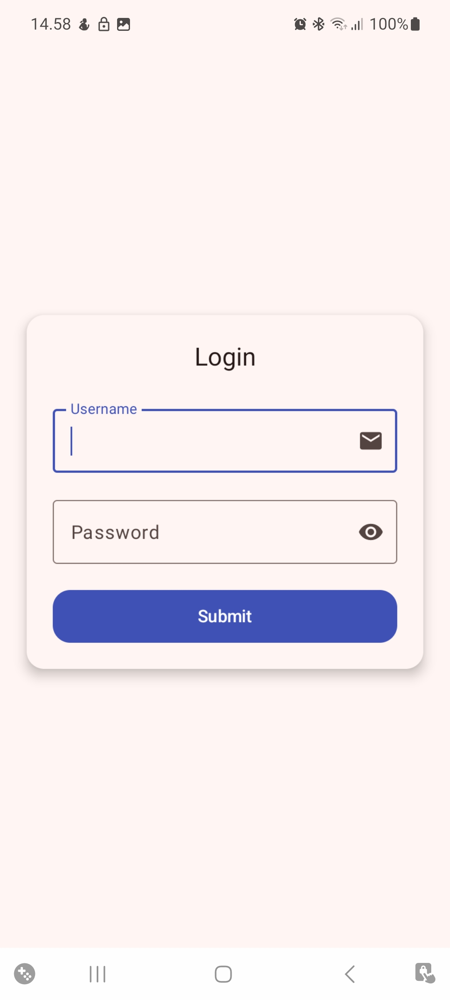
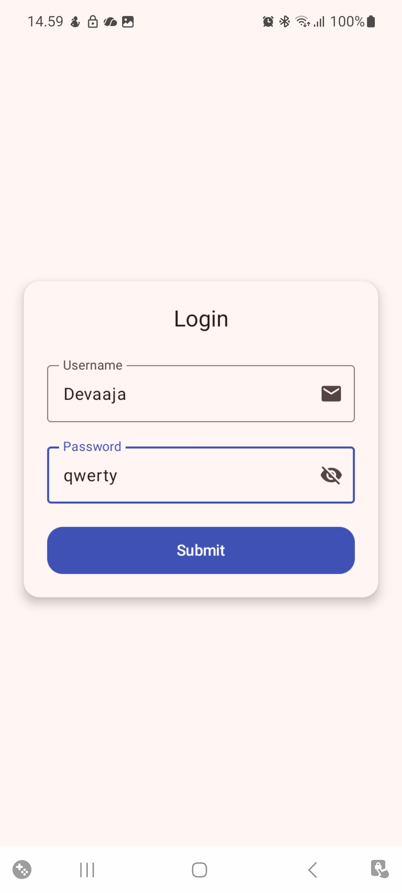
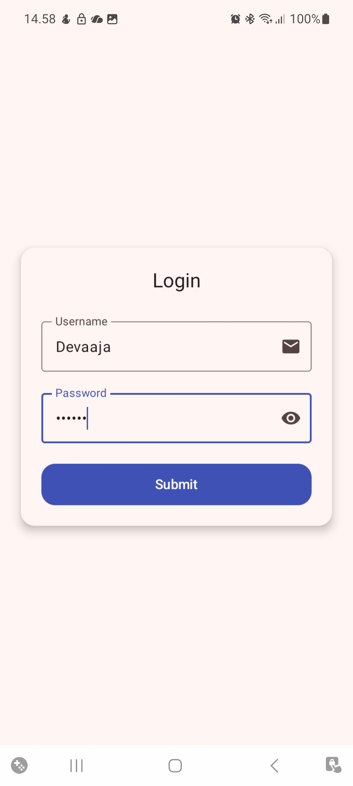
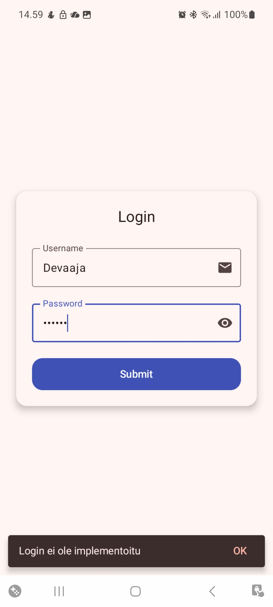

# 📱 Login-lomake (Jetpack Compose)

Tämä on pieni Android-harjoitusprojekti, jossa toteutetaan moderni
**login-näkymä** Jetpack Composella ja Material Design 3 -komponenteilla.

Projekti näyttää, miten rakennetaan selkeä lomake, jossa on:
- OutlinedTextField-tekstikentät
- Ikonit kentissä (email / salasana)
- Silmäikoni (näytä/piilota salasana)
- Card-näkymä varjostuksella
- Snackbar-ilmoitus "Submit"-painikkeesta

---

## 🔧 Ominaisuudet

- ✉️ Käyttäjätunnuskenttä (OutlinedTextField + email-ikoni)
- 🔒 Salasanakenttä (OutlinedTextField)
- 👁 Näytä/piilota salasana -toiminto
- 🃏 Card-kontti pyöristetyillä kulmilla ja elevatiolla
- 📣 Snackbar-ilmoitus
- 🎨 Material Design 3 -tyyli
- 🧱 Selkeä Jetpack Compose -rakenne

---

## 📸 Kuvakaappaukset

    
    
    
    

